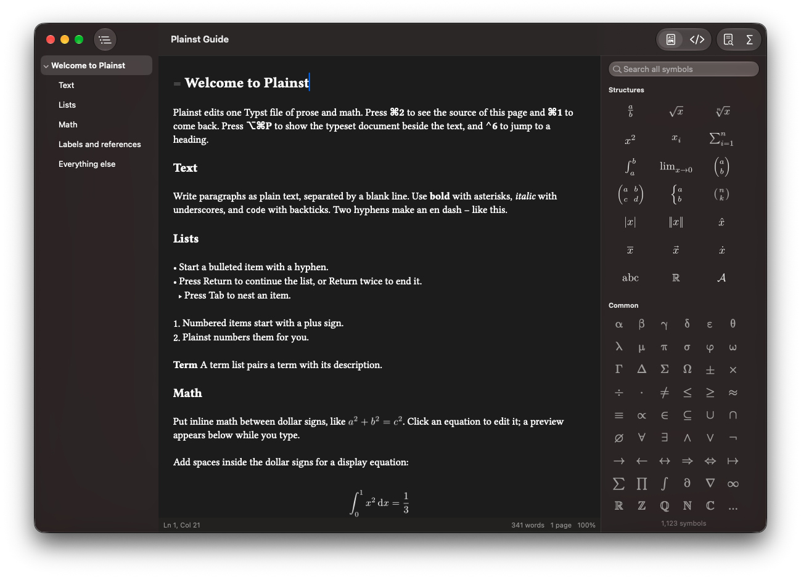

# Plainst

Plainst is a small, native macOS editor for single-file [Typst](https://typst.app) documents of prose and math. It shows headings, emphasis, lists, and rendered equations while you write, and it always saves an ordinary `.typ` file exactly as you typed it. Plainst requires macOS 13 or newer and works entirely offline.



## Install

Download Plainst from [GitHub Releases](https://github.com/PoteNad/plainst/releases), or install it with Homebrew:

```sh
brew install --cask PoteNad/tap/plainst
```

Homebrew includes Plainst in its normal `brew upgrade` cycle. To update only Plainst, run `brew upgrade --cask plainst`.

The Homebrew cask verifies the app bundle and removes its quarantine attribute so Plainst can open normally. Direct downloads are not Apple-notarized, so macOS may require **Open Anyway** in **System Settings → Privacy & Security** on first launch.

## How it works

- **Writing** (⌘1) shows the document formatted with Typst's own fonts and equations rendered by the Typst compiler. Markup such as `*` or `=` is hidden until the cursor reaches it, and clicking an equation reveals its source with a live preview underneath.
- **Source** (⌘2) shows the file exactly as it is saved. Both views edit the same text, so switching never changes the document.
- **Preview** (⌥⌘P) shows the typeset document beside the text, updated as you type, so `#set` rules and other code show their effect. Only changed pages are redrawn, the preview follows the cursor, and clicking a page puts the cursor on that text.
- **Export as PDF** and **Print** typeset the document with the bundled Typst compiler, so the output matches `typst compile`.

Plainst formats paragraphs, headings, bold, italic, inline code and code blocks, bulleted, numbered, and term lists, dashes and other shorthands, and inline and display math. Anything else, such as `#set` rules or function calls, is kept exactly as written and shown in grey. Images, bibliographies, multiple files, and packages are intentionally unsupported.

## Features

- Native document windows and tabs, autosave, versions, Revert, Duplicate, Rename, and Move.
- Format commands that write plain Typst: Bold (⌘B), Italic (⌘I), Code, Headings (⌥⌘1–3), Bulleted and Numbered Lists (⇧⌘8, ⇧⌘7), Equations (⌥⌘E, ⇧⌥⌘E).
- Document Style in the Format menu sets the document's font, size, and justification by writing Typst `#set` rules, and the Writing view follows them.
- Return continues a list and ends it on an empty item. Tab and Shift-Tab indent lines and nest list items by the tab width, with optional indentation guides.
- An outline sidebar (⌃⌘S) of the document's headings that follows the cursor, Go to Heading (⌃6), and folding for the sections under headings.
- Links that work: ⌘-click opens a web address or moves from an `@reference` to its label, and pasting an address over selected words writes `#link`.
- Pasting from web pages and word processors converts headings, bold, italics, lists, and links to Typst markup; Paste and Match Style (⌥⇧⌘V) keeps plain text.
- Completions from Typst's own IDE engine for symbols, math functions, code, and label references after `@` (⌥⎋ to ask), with snippet placeholders you can Tab through.
- Code blocks that name a language are highlighted with the same syntax definitions Typst uses, and typing ```` ``` ```` suggests the languages Typst knows.
- Automatic pairs for dollar signs, brackets, backticks, and quotes in code; typing `*` or `_` over a selection wraps it. The bracket beside the cursor and its partner are highlighted.
- A symbols inspector (⌥⌘T) to search and insert Typst symbols and common math structures.
- Settings for the default view, Writing zoom, text width, Source font, tab width, new document line endings, and each kind of typing assistance.
- Live Typst diagnostics with underlines, messages at the ends of their lines, and a status bar menu, plus page counts and word or character counts for the document or the selection.
- Find and replace, spelling, zoom, light and dark appearances, and optional Apple Writing Tools that are off by default.
- Opening and saving an unedited file keeps it byte-for-byte identical, including line endings and byte order marks.

## Build from source

Plainst needs Xcode or the Command Line Tools with the macOS 26 SDK or newer, plus a Rust toolchain. The built app still runs on macOS 13 and newer.

```sh
./scripts/build.sh
open build/Plainst.app
```

The build compiles the Typst engine in `engine/` as a static library, builds the Swift app, and ad-hoc signs it for the current Mac. Run `./scripts/check.sh` for the full test suite, which includes end-to-end checks of editing, saving, and PDF export.

## Using the editor in another app

The editor itself is the `PlainstEditor` library in this package, separate from the Plainst app. `TypstEditor` provides the Writing and Source views, rendered equations, Typst completions, automatic pairs, bracket matching, and diagnostics. The app adds documents, the toolbar, the status bar, the outline, the preview, and the symbols inspector around it.

```swift
import PlainstCore
import PlainstEditor

Typefaces.registerBundledFonts()  // once, at launch
let editor = TypstEditor(text: "Let $x = 5$.", configuration: .init(completions: true))
editor.delegate = self  // TypstEditorDelegate: text, selection, display and compile events
window.contentView = editor.scrollView
```

Commands such as `toggle(_:actionName:)`, `insertEquation(block:)`, `insertMath(_:snippet:)`, and `setMode(_:)` edit the text through the text view, so they can be undone. The library links the Typst engine, so build it with `./scripts/build.sh` first.

## License

MIT — see [LICENSE](LICENSE). Plainst includes the Typst compiler, the Rust crates it depends on, and Typst's bundled fonts, each under its own license; see [THIRD_PARTY_NOTICES.md](THIRD_PARTY_NOTICES.md), which the app also shows in Help ▸ Acknowledgments. After changing the engine's dependencies, run `swift scripts/generate-notices.swift` to update it.
